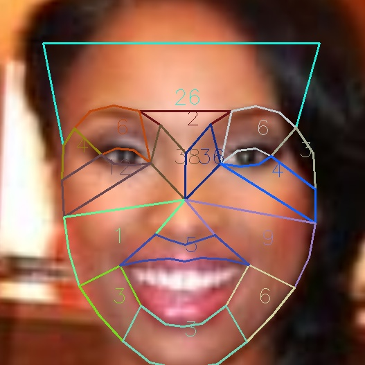
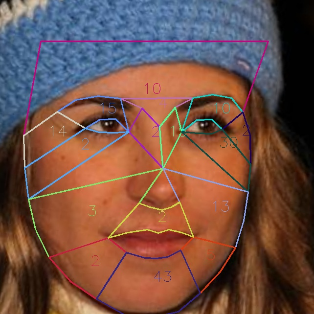
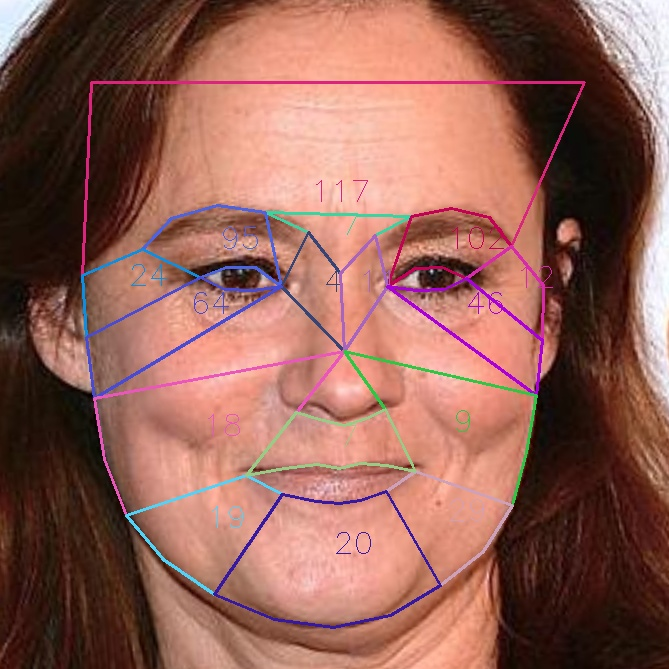
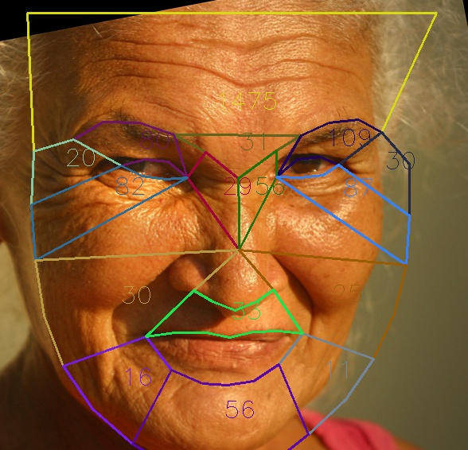

# Age Estimation from Rhytides -- Mid-Term Report

**Group Members**: [Tom Reitz](https://github.com/tomreitz) (treitz@wisc) and [Zach Baklund](https://github.com/zbaklund) (baklund@wisc)

(Please see our earlier [Project Proposal](proposal.md) for background.)

### Progress

As outlined in our [proposal](proposal.md), we have completed the following steps:
* Implement Python code with OpenCV and Haar filters to detect faces and facial landmarks in face images
* Segment faces using facial landmarks into polygon regions corresponding to each of the ten rhytide types mentioned in the proposal
* Implement Python code to do edge-detection within each polygon to quantify rhytides in the region
* Annotate face images with polygons and edge-detection values for each polygon

For annotating the face images with edge-detection values, we currently mask out the region of interest (for each of our regions)
As shown here:
* {'forehead': 28, 'frown': 30, 'upper_eye_hood_left': 12, 'upper_eye_hood_right': 13,'crows_feet_left': 32, 'crows_feet_right': 36, 'bunny_lines_left': 14, 'bunny_lines_right': 15, 'bags_left': 8, 'bags_right': 9, 'laugh_lines_left': 15, 'laugh_lines_right': 15, 'jowls_left': 10, 'jowls_right': 11, 'lip_lines': 4, 'mental_crease': 8}
We return the resulting number of edges in that particular region. This gives us the ability to also return other values in addition if we decide to change the method of edge detection or add functionality to ignore already apparent corner cases (eyeglasses, hairbangs, facialhair)
If during our machine learning phase of this project we want to train on more values than just the number of edges per region.

We have also explored several publicly-available face image datasets to use in this project:

[**"Labeled Faces in the Wild" (LFW) dataset**](http://vis-www.cs.umass.edu/lfw/)
- Provides no age information for the images, so we eliminated this from consideration

[**UTKFaces face image dataset**](https://susanqq.github.io/UTKFace/)
- 23,708 images all labeled with  gender, age, and race (encoded in file names)
- Images are all 200x200 pixels in size
- Mostly head-on views of faces, but quality for some is poor (grainy or washed-out images)
- Running facial landmark detection code takes (2.1 secs/image), and faces are identified in 72% of images

[**IMDB-WIKI face image dataset**](https://data.vision.ee.ethz.ch/cvl/rrothe/imdb-wiki/)
- 460,723 images from IMDB (actors)
- 62,328 images from Wikipedia (celebrities)
- Dataset includes gender and age for each image, but not race (details are in .mat files in each dataset, which can be converted to CSV using [mat.py](code/mat.py))
- Images vary in size, most are at least 200x200 pixels, some much higher
- Some images are poor quality, include multiple faces, are a side-view of a face, or even something like a cartoon, but most are good
- Running facial landmark detection code on takes 1.9 secs per image, and faces are identified in 61% of Wikipedia images and 70% of IMDB images

We expect the best results to come from using larger images from the IMDB-WIKI dataset, but we will also try the UTKFaces dataset.

### Initial results
Here are examples of four annotated face images produced by our code:

| Younger 1      | Younger 2    | Older 1      | Older 2     |
| :------------: | :----------: | :----------: | :---------: |
|    |    |     |     |
| Total: 164     | Total: 175   | Total: 574   | Total: 2,150 |

These images show a promising early result: younger faces have fewer edges detected than older faces.

### Further work
Our next steps include
* Trying several different edge-detection algorithms (canny, Sobel, etc.) and selecting one based on performance
* Exploring techniques to deal with face obstructions like bangs/hair, eyeglasses, or facial hair (mustache/beard)
* Running our code on a large number of face images to collect data
* Analyzing the data and using it to refine our edge-detection  algorithm as needed
* Training a simple machine-learning system to estimate/predict age based on rhytide values
