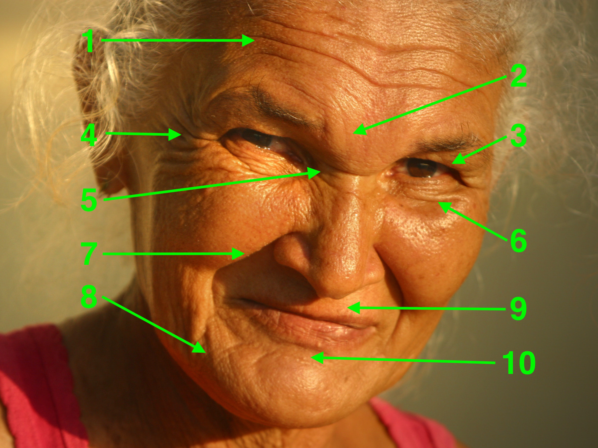

# Age Estimation from Rhytides

**Group Members**: [Tom Reitz](https://github.com/tomreitz) (treitz@wisc) and [Zach Baklund](https://github.com/zbaklund) (baklund@wisc)

### Introduction

Age estimation from face images is an active research area [[1](https://jivp-eurasipjournals.springeropen.com/articles/10.1186/s13640-018-0278-6)], with applications ranging from facial aging simulation to security, surveillance, and biometrics.

Various aspects of human faces change as we age. In children, head shape changes rapidly as the skull and jaw develop. In adults, head and facial hair color and density change, skin blemishes may appear, and rhytides (facial wrinkles) often develop as a result of the breakdown of collagen in the skin.

Age estimation can be difficult and imprecise, as environmental and genetic factors affect aging rate and make perceived age vary greatly among individuals. Many studies use distances between facial landmarks for age estimation. [[2](https://www.researchgate.net/publication/228404297_Classification_of_Age_Groups_Based_on_Facial_Features)] used Sobel edge magnitude to extract wrinkle density and depth from face images for age estimation, but this work did not differentiate types of wrinkles in different parts of the face. Other recent work has focused on global methods including deep learning on face image sets.

In this project, we focus on age estimation based on specific types of rhytides as they appear in different parts of faces:

1. Forehead lines

2. Glabellar frown lines

3. Upper eyelid hooding

4. Crow's feet (outside corners of eyes)

5. Bunny lines (inside corners of eyes)

6. Bagging of lower lids

7. Nasolabial folds (laugh lines)

8. Marionette lines or jowls

9. Lip lines (vertical lines on upper and/or lower lip)

10. Mental crease (between chin and lower lip)

### Proposed Work

We will use existing face detection software ([OpenCV](https://opencv.org/)) to detect faces in an image, then we will use edge detection in specific parts of the face image to identify and quantify the prescence of the aforementioned types of rhytides. With this code, we will process existing datasets (such as [[3](https://susanqq.github.io/UTKFace/)], [[4](https://data.vision.ee.ethz.ch/cvl/rrothe/imdb-wiki/)], or [[5](https://www.cs.columbia.edu/CAVE/databases/facetracer/)]) of age-labeled face images to study the distributions of each rhytide type by age and gender. We will train a simple ML model to predict age from rhytide measurements, and finally we will compose all of these steps into an age-prediction pipeline.

### Challenges

Image quality issues such as poor lighting or low resolution may make detecting and quantifying rhytides more difficult. We will mitigate this by studying only high-quality face images.

Facial expressions also change the appearance of rhytides -- a smiling, angry, or surprised face may show different wrinkles than a neutral one. We may be able to use [[6](https://github.com/ebarsoum/FERPlus)] to classify emotion in a face image and then weight the rhytide intensities differently for each emotion.

Finally, other factors may interfere with rhytide detection, such as makeup or facial hair obscuring some rhytides. This issue has no simple solution.

### Timeline

* By March 10, we will have written code that detects faces in an image.

* By March 24 (in time for the Midterm Report), we will have written code that segments areas of a face image in which to search for each rhytide type, and does edge detection within each area to quantify the intensity of each rhytide type in the face. We will show the results of this code for several example face images in our report.

* By April 9, we will have processed at least one large face image dataset using our rhytide detection code, and we will analyze the results to determine the distribution of different rhytide types by age and gender.

* By April 23 (in time for the Final Presentation), we will present our findings from above and we will have train an ML model to predict age based on rhytide intensities. We plan to demonstrate the model's predictions on sample face images in our presentation.

